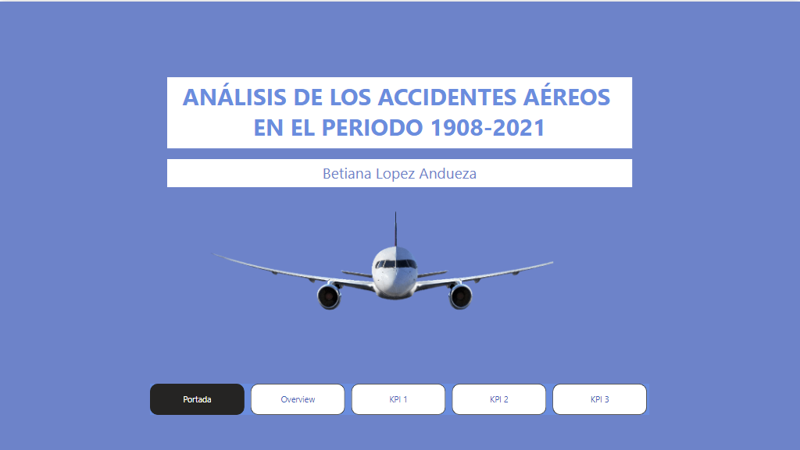
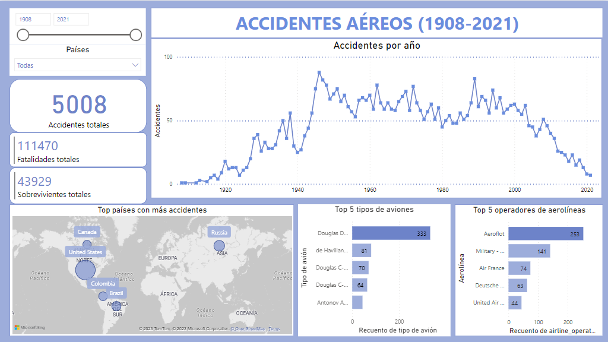
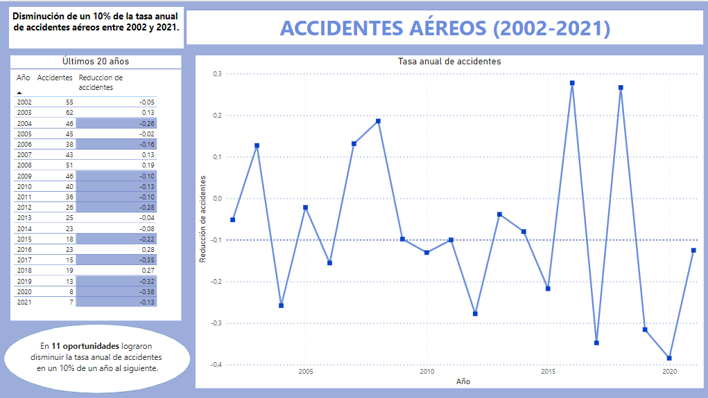
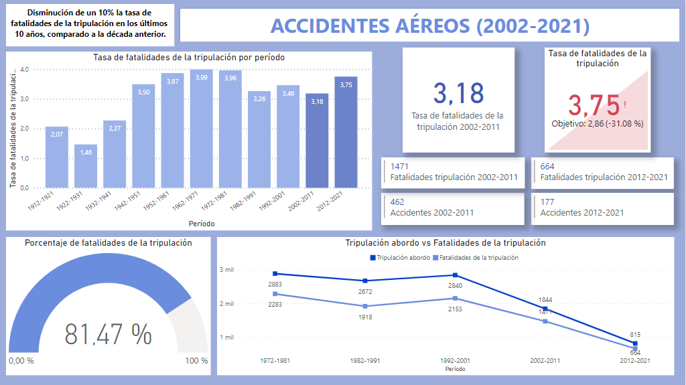
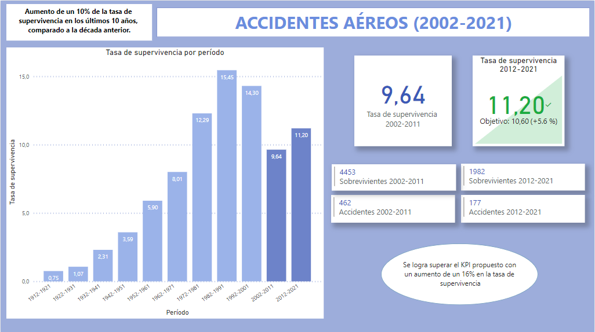

# Proyecto Individual Data Analytics: Accidentes aéreos

Este proyecto consiste en analizar los accidentes aéreos ocurridos desde 1908 y hasta 2021 y presentar los insights más importantes es un dashboard de Power BI.

 

 

## Índice

- [Introducción](#Introducción)
- [Objetivo](#Objetivo)
- [Repositorio](#Repositorio)
- [Pasos para la realización de este proyecto](#Pasos)
- [ETL](#ETL)
- [EDA: Exploratory Data Analysis](#EDA)
- [Dashboard](#Dashboard)
- [Conclusiones](#Conclusiones)
- [Herramientas utilizadas](#Herramientas)
- [Enlace al proyecto](#Enlace)
- [Disclaimer](#Disclaimer)

 

## Introducción

El proyecto se basa en el análisis de los datos históricos recolectados de fuentes públicas sobre accidentes aéreos ocurridos entre 1908 y 2021. 

El Convenio sobre Aviación Civil Internacional contiene las normas y métodos recomendados para la Investigación de accidentes e incidentes de aviación, define un accidente como todo suceso relacionado con la utilización de una aeronave:
 - en que cualquier persona sufre lesiones mortales o graves;
 - en que la aeronave sufre daños o roturas estructurales que exigen reparación;
 - tras el que la aeronave se considera desaparecida.

Los accidentes aéreos son eventos inesperados e indeseados que involucran aeronaves y se producen daños a las personas o daños físicos y materiales a la propia aeronave.

Los accidentes aéreos pueden ser causados por diversos factores, como errores humanos, fallos de equipos, problemas meteorológicos, problemas de mantenimiento, fallas en la gestión del tráfico aéreo, problemas de diseño o problemas de fabricación.

Es por eso que la industria de la aviación, las autoridades reguladoras y los investigadores trabajan  para mejorar la seguridad de la aviación y prevenir futuros accidentes. Por otro lado, el estudio de la causalidad de los accidentes y aprender a cómo prevenirlos es clave para poder evitar pérdidas humanas y daños materiales.

 

## Objetivo
El objetivo principal de proyecto es poder obtener un análisis de datos relacionado con el entendimiento de los accidentes aéreos ocurridos a lo largo de la historia, que permita realizar acciones en lo preventivo. Se presentarán los resultados junto a 3 KPIs propuestos en un dashboard que complemente los análisis con sus visualizaciones.

 

## Repositorio

El repositorio de esta proyecto está conformado por los siguientes archivos:

- En el archivo [01_ETL.ipynb](01_ETL.ipynb) se presenta el ETL y un primer acercamiento a un análisis exploratorio de los datos que posee el dataset brindado.
- En el archivo [02_EDA.ipynb](02_EDA.ipynb) presenta el análisis exploratorio de datos, donde se buscan relaciones entre las variables así como tendencias y/o patrones.
- En el archivo [03_KPIs.ipynb](03_KPIs.ipynb) se presenta el análisis en python de los KPIs propuestos.
- En el archivo [04_Conexion_sql.ipynb](03_Conexion_sql.ipynb) se presenta la conexión con SQL.
- En el archivo [05_Verificacion_carga_sql.sql](04_Verificacion_carga_sql.sql) se presenta un ejemplo de consulta para constatar la carga de los datos desde el archivo 03. Por falta de tiempo, la importación a Power BI se hizo a partir del CSV y no mediante la conexion con SQL, pero se presentan los pasos realizados.

 

## Pasos para la realización de este proyecto
## ETL

Una vez realizado un primer acercamiento con los datos del archivo [AccidentesAviones.csv](AccidentesAviones.csv), se procede a investigar las columnas de nuestro dataset. 

De la información brindada, concluimos que el diccionario de datos del dataset se resume como:

- **Unnamed: 0:** índice para cada registro de accidente aéreo
- **fecha:** fecha en la que ocurrió el accidente aéreo
- **HORA declarada:** hora declarada del accidente aéreo
- **Ruta:** ubicación geográfica donde ocurrió el accidente aéreo
- **OperadOR:** compañía aérea operadora del vuelo
- **flight_no:** número de vuelo
- **route:** ruta del vuelo, indicando los puntos de partida y destino
- **ac_type:** tipo de aeronave involucrada en el accidente
- **registration:** número de registro o matrícula de la aeronave
- **cn_ln:** número de serie de la aeronave
- **all_aboard:** total de personas a bordo (pasajeros y tripulación)
- **PASAJEROS A BORDO:** total de pasajeros a bordo
- **crew_aboard:** total de tripulación a bordo
- **cantidad de fallecidos:** total de personas fallecidas en el accidente (pasajeros y tripulación)
- **passenger_fatalities:** total de pasajeros fallecidos en el accidente
- **crew_fatalities:** total de tripulantes fallecidos en el accidente
- **ground:** total de personas en tierra fallecidas en el accidente
- **summary:** resumen del accidente de vuelo y las circunstancias

 

En el archivo [01_ETL.ipynb](01_ETL.ipynb) se muestra todo el proceso realizado. que consiste en la extracción, transformación y carga de los datos se realizó la limpieza y el procesamiento de los datos. Los pasos seguidos consistieron:
- Normalización de los nombres de las columnas
- Eliminación de duplicados
- Reemplazo de los '?' por Nan.
- Tratamiento de valores faltantes.
- Corrección de errores de tipeo (sobre todo en la columna location).
- Cambio de los tipos de datos según sea necesario. 
- Creación de columnas con información valiosa.

 
Del proceso de ETL obtenemos el archivo [Accidentes_tratado.csv](Accidentes_tratado.csv). 

 

## EDA: Exploratory Data Analysis 

En el archivo [02_EDA.ipynb](02_EDA.ipynb) se realizaron el análisis estadístico y las visualizaciones de los datos tratados en detalle.

- Se mostraron los análisis estadísticos y una matriz de correlación de las variables cuantitativas 
- Se realizaron visualizaciones de distintos tipos de gráficos para encontrar relaciones entre variables: 
        - accidentes por año,   
        - accidentes por país,  
        - accidentes por año,  
        - países con más accidentes, 
        - ciudades con más accidentes,  
        - accidentes por airline_operator,  
        - accidentes por aircraft_type,  
        - accidentes por categoría,  
        - porcentaje de accidentes en agua,  
        - fallecidos por año,  
        - fallecidos por la tripulación por año,  
        - sobrevivientes, entre otras.  

- Se realizaron gráficas comparativas de: 
        - total de fallecidos vs personas abordo,  
        - pasajeros fallecidos en función de pasajeros abordo, 
        - miembros de la tripulacion fallecidos vs miembros de tripulación abordo y 
        - sobrevivientes vs  personas abordo
- Exploración de las variables en búsqueda de patrones.
- Identificación de ciertos valores que podrían ser atípicos.

 

En el archivo [02_EDA.ipynb](02_EDA.ipynb) se ve todo el análisis con sus respectivas gráficas.
 

Al final del archivo [03_KPIs.ipynb](03_KPIs.ipynb) se presenta el análisis de los KPIs propuestos.

    

## Dashboard

En el dashboard se visualizará la información extraída luego del EDA de los datos. 
- En primera instancia haremos un overview por los patrones y tendencias más importantes para los accidentes aéreos del período 1908-2021.
- Luego, definiremos unos indicadores claves de desempeño (KPI) que nos permitan evaluar el rendimiento y el éxito de la organización. En este caso, definiremos 3 KPIs (uno solicitado y dos propuestos) para el período 2002-2021.
- Se elige el color azul para la realización del dashboard porque es un color que representa seguridad, tranquilidad y responsabilidad, lo cual siento que es es ideal para abordar una temática catastrófica como los accidentes y la comunicación de fallecimientos.

 

### Overview:

En lo referido al overview podemos encontrar información general sobre la información del dataset sobre la totalidad de los accidentes:

- Total de accidentes
- Total de fallecidos
- Total de sobrevivientes
- Cantidad de accidentes por periodo
- Top 5 tipos de aeronaves con más accidentes
- Top 5 operadores de aerolíneas con más accidentes

 

 

### KPIs planteados
 

Luego del análisis del dataset durante el período 1908-2021, decidimos centrar nuestros KPIs en los últimos años 20 años (2021 es el último año del cual tenemos información y desde ese momento 20 años para atrás).

#### KPI 1: Evaluar la reducción en un 10% de la tasa anual de accidentes a nivel mundial durante los años 2002-2021.

 

Luego del año 1990, puede evidenciarse un descenso de los accidentes, queremos verificar que los intentos de disminuir los accidentes desde el año 2002 hasta el 2021 surgieron efecto, podemos ver una tendencia a nivel global, pero queremos conocer en cuántos de esos 20 años lograron disminuir la tasa en al menos un 10% con respecto al año anterior.

 

 

Podemos concluir de esta KPI que en 11 de los 20 años analizados, los intentos por disminuir los accidentes a nivel global tuvieron un efecto positivo y en más del 50% de los años considerados para este análisis, se logró disminuir la tasa anual de accidentes.

 

#### KPI 2: Evaluar la disminución del 10% de la tasa de fatalidad de la tripulación en los últimos 10 años, comparado a la década anterior.

 

Considerando el año 2021 como el último año del que poseemos información, cuando mencionamos los últimos 10 años, tenemos en cuenta el periodo 2012-2021, y la decada anterior 2002-2011.

La tasa de fatalidad de la tripulación se considera como el número total de tripulantes fallecidos en los accidentes registrados en la década a considerar, dividido en la cantidad total de accidentes aéreos ocurridos en este período de tiempo. Su fórmula es (Suma total de fallecidos en el período de tiempo / Suma total de accidentes en el período de tiempo).

Se realiza un gráfico de barras, donde comparamos el período 2012-2021 con el período anterior. Se presenta en barras como una manera de evaluar correctamente la información del período y evaluar mejor a simple vista el aumento o disminución por período.

 

 

Concluímos que el KPI no se cumple, debido a que la tasa de fatalidades de la tripulación pasa de 3.18 a 3.75, por lo que se produce un aumento de casi el 18% en comparación con la década 2002-2012. Si bien disminuyen las fatalidades de la tripulación en un 58% (pasando de 1471 a 664), y los accidentes también disminuyeron casi a un tercio del valor de los 10 años anteriores (de 462 a 177), puede observarse que la tasa aumenta, debido a que son inversamente proporcionales.
En un análisis más exhaustivo, pudimos evidenciar que de los 177 accidentes ocurridos durante los años 2012-2021, en 131 accidentes de los 177 totales, falleció la totalidad de la tripulación lo que sin lugar a dudas, desfavorece la tasa del KPI que estamos calculando.

 

#### KPI 3: Evaluar el aumento de un 10% de la tasa de superviviencia en los últimos 10 años, comparado a la década anterior.

 

Considerando nuevamente el año 2021 como el último año del que poseemos información, cuando mencionamos los últimos 10 años, tenemos en cuenta el periodo 2012-2021, y la decada anterior 2002-2011.

La tasa de supervivencia la consideramos como el número total de sobrevivientes en los accidentes registrados en la década a considerar, dividido en la cantidad total de accidentes aéreos ocurridos en este período de tiempo. Su fórmula es (Suma total de sobrevivientes en el período de tiempo / Suma total de accidentes en el período de tiempo).

Nuevamente presentamos un gráfico de barras, donde comparamos el período 2012-2021 con el período anterior. 
 

 

Podemos efectivamente evaluar que la tasa de supervivencia del período 2002-2011 fue de 9.64, mientras que entre los años 2012-2021 fue de 11.64. Superamos el KPI propuesto de un aumento del 10% con un aumento del  16%.

 

## Conclusiones

Durante el análisis del dataset y de los KPIs presentados podemos abordar a las siguientes conclusiones:
- En total ocurrieron 5008 accidentes entre los años 1908 (año donde ocurrió el primer accidente aéreo de la historia) y el 2021. Durante ese período se perdieron 111470 vidas, pero lograron sobrevivir 43929 personas.
- El papel de Estados Unidos en los accidentes aéreos no es menor, el 20% de los accidentes ocurrieron en Estados Unidos, 1042 accidentes en total. 
- Pueden verse períodos donde los aumentos de accidentes podrían estar relacionados con hechos históricos como la Primera Guerra Mundial (1914-1918), la Segunda Guerra Mundial (1939-1945) o la Guerra Fría. Sin embargo, no poseemos información suficiente para indicar una relación directa entre los datos y los hechos mencionados.
- En el 15% de los accidentes, se encuentran involucrados aeronaves de tipo militar, mientras que el 85% restante podría corresponderse con accidentes donde los aviones son de pasajeros. 
- Dentro de los tipos de aviones con más accidentes, el record se lo lleva el avión Douglas DC-3, creado en 1935 por la aerolínea estadounidense Douglas Aircraft Company. Este tipo de avión posee en total 333 accidentes registrados.
- En lo que refiere a los operadores de aerolíneas con más accidentes, el top 1 lo lleva Aeroflot, una aerolínea rusa fundada en 1923.

 

- Referido al primer KPI, podemos evidenciar un claro descenso de la tasa anual de accidentes aéreos. Específicamente en el período de análisis 2002-2021, podemos evidenciar que en 11 de los 20 años, la tasa anual disminuyó al menos en un 10% respecto del año anterior, lo que indica el compromiso de las autoridades pertinentes para disminuir los accidentes en los últimos años. 
- Referido al segundo KPI, podemos decir que no ocurre una disminución del 10% de la tasa de fatalidades de la tripulación definida como la tasa de fatalidades de la tripulacion / suma de accidentes en el período. Tal y como está planteado este KPI, no se logra cumplir, ya que las variables comprometidas resultan inversamente proporcionales. 
- Referido al último KPI, hemos cumplido el objetivo, la tasa de supervivencia propuesta que era del 10% y los valores calculados evidencian un aumento del 16% para el período 2012-2021 en comparación con el período 2002-2011.

## Herramientas utilizadas
- Python
- Pandas
- Matplotlib
- Seaborn
- Power BI

## Enlace al proyecto

El proyecto publicado puede encontrarse en el siguiente enlace: [Proyecto Power BI - Accidentes aéreos](https://www.novypro.com/project/proyecto---an%C3%A1lisis-accidentes-a%C3%A9reos)

## Disclaimer

Se quiere aclarar y remarcar que los fines de este proyecto son exclusivamente pedagógicos, con el objetivo de realizar proyectos que simulen un entorno laboral, en el cual se trabajen diversas temáticas ajustadas a la realidad. Además, toda la información expuesta y resultados obtenidos en los proyectos nunca deben ser tomados en cuenta para la toma real de decisiones.